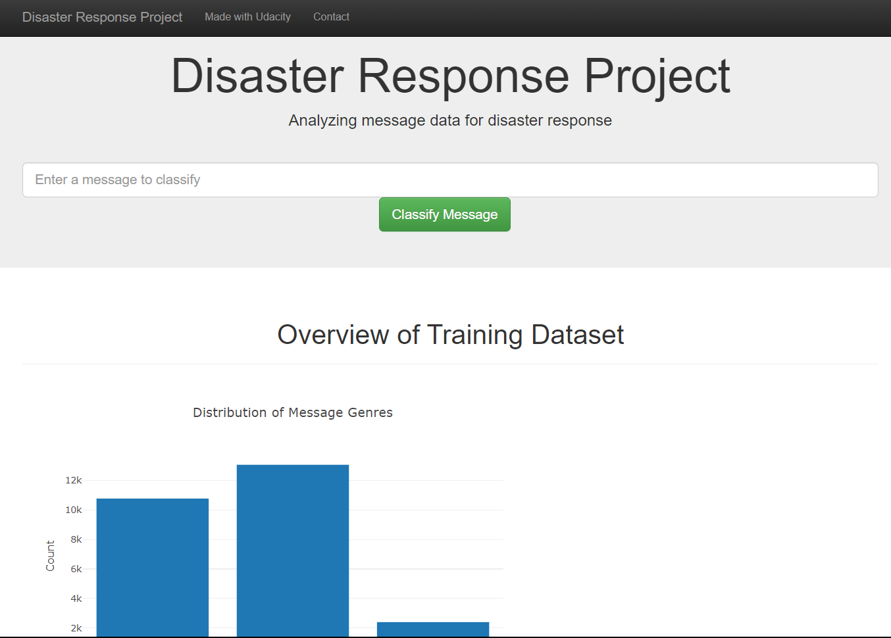

# Disaster Response Pipeline Project



### Table of Contents
1. [Installation](#installation)
2. [Project Motivation](#motivation)
3. [File Descriptions](#files)
4. [Results](#results)
5. [Instructions](#instructions)
5. [Acknowledgements](#acknowledgements)

## Installation <a name="installation"></a>

Use the Python version 3.7.0 and install the libraries in the requirements.txt file of this repo

```
pip install requirements.txt
```

## Project Motivation<a name="motivation"></a>

The motivation behind this project is to apply data engineering to analyze disaster data from Appen and build a predicting model for a web app that can classify disaster messages. The goal is to create a machine learning pipeline that categorizes these messages, allowing emergency workers to send them to the appropriate disaster relief agency quickly.

The project's ultimate objective is to improve the efficiency and effectiveness of disaster response efforts. By providing a tool that can accurately categorize disaster messages, emergency workers can focus their efforts on addressing the most urgent needs, saving time and potentially saving lives.

## File Descriptions <a name="files"></a>

This repo is organized in three main folders:
- The app folder contains files related to the web application that is being built as part of the project. Inside of it there is the "template" folder that contains two HTML files: "master.html" and "go.html," . The "run.py" file is a Flask file that runs the web app and handles incoming requests.

- The "data" folder contains data files and a Python script for processing them. The "disaster_categories.csv" file contains the categories of disaster messages, while "disaster_messages.csv" contains the actual messages. The "process_data.py" script is used to merge and clean these two data files, and save the resulting data to the "DisasterResponse.db" database.

- The "models" folder contains a Python script, "train_classifier.py," which is used to train the machine learning model on the cleaned data generated by "process_data.py." The resulting model is saved as "classifier.pkl" in this folder.

## Results<a name="results"></a>

### Model Performance Metrics 

During the optimization of the models, the classifier that had a better performance on the dataset was the multilayer perceptron. The model conducted the following metrics on the test split:

| Category               | Precision | Recall   | F1-Score | Support   |
|------------------------|-----------|----------|----------|-----------|
| request                | 0.47      | 0.55     | 0.51     | 909       |
| offer                  | 0.00      | 0.00     | 0.00     | 27        |
| aid_related            | 0.60      | 0.65     | 0.62     | 2158      |
| medical_help           | 0.31      | 0.31     | 0.31     | 427       |
| medical_products       | 0.37      | 0.32     | 0.34     | 260       |
| search_and_rescue      | 0.30      | 0.19     | 0.23     | 138       |
| security               | 0.05      | 0.02     | 0.03     | 97        |
| military               | 0.48      | 0.39     | 0.43     | 167       |
| child_alone            | 0.00      | 0.00     | 0.00     | 0         |
| water                  | 0.61      | 0.49     | 0.54     | 328       |
| food                   | 0.60      | 0.57     | 0.59     | 613       |
| shelter                | 0.52      | 0.47     | 0.50     | 476       |
| clothing               | 0.46      | 0.30     | 0.37     | 79        |
| money                  | 0.47      | 0.27     | 0.34     | 140       |
| missing_people         | 0.18      | 0.12     | 0.14     | 50        |
| refugees               | 0.31      | 0.21     | 0.25     | 186       |
| death                  | 0.59      | 0.44     | 0.51     | 229       |
| other_aid              | 0.24      | 0.35     | 0.29     | 668       |
| infrastructure_related | 0.17      | 0.17     | 0.17     | 333       |
| transport              | 0.22      | 0.23     | 0.22     | 203       |
| buildings              | 0.44      | 0.31     | 0.36     | 278       |
| electricity            | 0.42      | 0.31     | 0.36     | 91        |
| tools                  | 0.25      | 0.03     | 0.05     | 33        |
| hospitals              | 0.22      | 0.07     | 0.11     | 58        |
| shops                  | 0.50      | 0.04     | 0.07     | 27        |
| aid_centers            | 0.09      | 0.04     | 0.05     | 57        |
| other_infrastructure   | 0.17      | 0.14     | 0.15     | 224       |
| weather_related        | 0.60      | 0.62     | 0.61     | 1423      |
| floods                 | 0.55      | 0.52     | 0.54     | 425       |
| storm                  | 0.60      | 0.54     | 0.57     | 479       |
| fire                   | 0.56      | 0.17     | 0.26     | 54        |
| earthquake             | 0.66      | 0.56     | 0.61     | 488       |
| cold                   | 0.51      | 0.26     | 0.34     | 96        |
| other_weather          | 0.22      | 0.18     | 0.20     | 265       |
| direct_report          | 0.43      | 0.50     | 0.47     | 1025      |
| **micro avg**          | **0.48**  | **0.47** | **0.47** | **12511** |
| **macro avg**          | **0.38**  | **0.30** | **0.32** | **12511** |
| **weighted avg**       | **0.48**  | **0.47** | **0.47** | **12511** |
| **samples avg**        | **0.33**  | **0.28** | **0.27** | **12511** |

### Get your own results with the API

Also, you can type your own messages in the API so the trained MLP classifier returns the predicted category!

You can do that by following the instructions below

## Instructions <a name="instructions"></a>
1. Run the following commands in the project's root directory to set up your database and model.

    - To run ETL pipeline that cleans data and stores in database
        `python data/process_data.py data/disaster_messages.csv data/disaster_categories.csv data/DisasterResponse.db`
    - To run ML pipeline that trains classifier and saves
        `python models/train_classifier.py data/DisasterResponse.db models/classifier.pkl`

2. Go to `app` directory: `cd app`

3. Run your web app: `python run.py`

4. Click on the address displayed on the terminal

## Acknowledgements<a name="acknowledgements"></a>

Credits to Appen for the data and Udacity for providing the projects' structure and base code.
